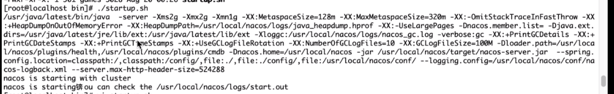

# jvm各参数意思

1. verbose:gc
2. -XX:+printGC
3. -XX:+printDetails
4. -XX:+printGCTimeStamps

nacos中相关jvm参数

sed -i 's/\r$//' ./startup.sh

~~~shell
/usr/local/java/jdk1.8.0_161/bin/java  -server -Xms2g -Xmx2g -Xmn1g -XX:MetaspaceSize=128m -XX:MaxMetaspaceSize=320m 
发送oom堆栈存放位置
-XX:-OmitStackTraceInFastThrow -XX:+HeapDumpOnOutOfMemoryError -XX:HeapDumpPath=/usr/local/nacos/logs/java_heapdump.hprof
 -XX:-UseLargePages 

-Dnacos.member.list= -Djava.ext.dirs=/usr/local/java/jdk1.8.0_161/jre/lib/ext:/usr/local/java/jdk1.8.0_161/lib/ext 
gc日志存放位置
-Xloggc:/usr/local/nacos/logs/nacos_gc.log -verbose:gc -XX:+PrintGCDetails -XX:+PrintGCDateStamps -XX:+PrintGCTimeStamps -XX:+UseGCLogFileRotation -XX:NumberOfGCLogFiles=10 -XX:GCLogFileSize=100M

 -Dloader.path=/usr/local/nacos/plugins/health,/usr/local/nacos/plugins/cmdb -Dnacos.home=/usr/local/nacos -jar /usr/local/nacos/target/nacos-server.jar  --spring.config.additional-location=file:/usr/local/nacos/conf/ --logging.config=/usr/local/nacos/conf/nacos-logback.xml --server.max-http-header-size=524288

~~~

- java8之前 方法区放在堆中，java8之后方法区（元空间）放在本地内存中

# ch2 理论+实战 构建完整JVM知识体系

- 学习资料
github：
1.vipcolud/monitor 
jvm参数类型👽	jinfo & jps(参数和进程查看)👽	jstat(类加载、垃圾收集、JIT 编译)👽	jmap+MAT(内存溢出)👽	jstack(线程、死循环、死锁)👽	JVisualVM(本地和远程可视化监控👽
使用 BTrace进行拦截调试👽	Tomcat 性能监控与调优👽	Nginx 性能监控与调优👽	JVM 层 GC 调优👽	JAVA代码层调优
2.Angelswen/JVM-LearningAndOptimize
JVM学习笔记与调优实战
JVM学习笔记与调优实战（一）：JVM内存结构
JVM学习笔记与调优实战（二）：GC
JVM学习笔记与调优实战（三）：Java对象内存分配与逃逸分析
JVM学习笔记与调优实战（四）：JVM参数及测试实例
JVM学习笔记与调优实战（五）：OOM测试实例与内存查看工具的使用
JVM学习笔记与调优实战（六）：Tomcat调优实例与性能测试工具Jemeter的使用
JVM学习笔记与调优实战（七）：调优工具的使用教程
