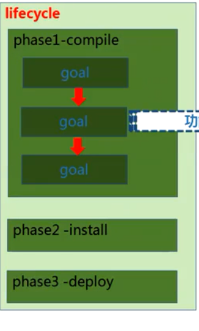

mvn clean package // 表示从生命周期clean到package，而不是单独执行clean，然后执行package
mvn clean install  // 表示生命周期从clean到install

maven插件：

1.插件
就是一个普普通通的Java项目。
打包方式改成 maven-plugin
引入2个依赖：maven-plugin-api、maven-plugin-annotation

~~~java
@Mojo(name = "log")
public class MyZkPlugin extends AbstractMojo {

    @Parameter(property="log.name",defaultValue="Peter")
    private Object name;

    public void execute() throws MojoExecutionException, MojoFailureException {
        getLog().info("hello"+name+" ,deploy to your local repository");
    }

}

~~~

- 执行插件
  mvn com.zk:maven-enjoy-plugin:1.0-SNAPSHOT:log  -Dlog.name=hx // 插件组织:名称:版本:目标 -D参数名=参数值

2. 一个插件可以有多个目标
   

3. 插件可以指定在该插件的某个生命周期执行某个目标

